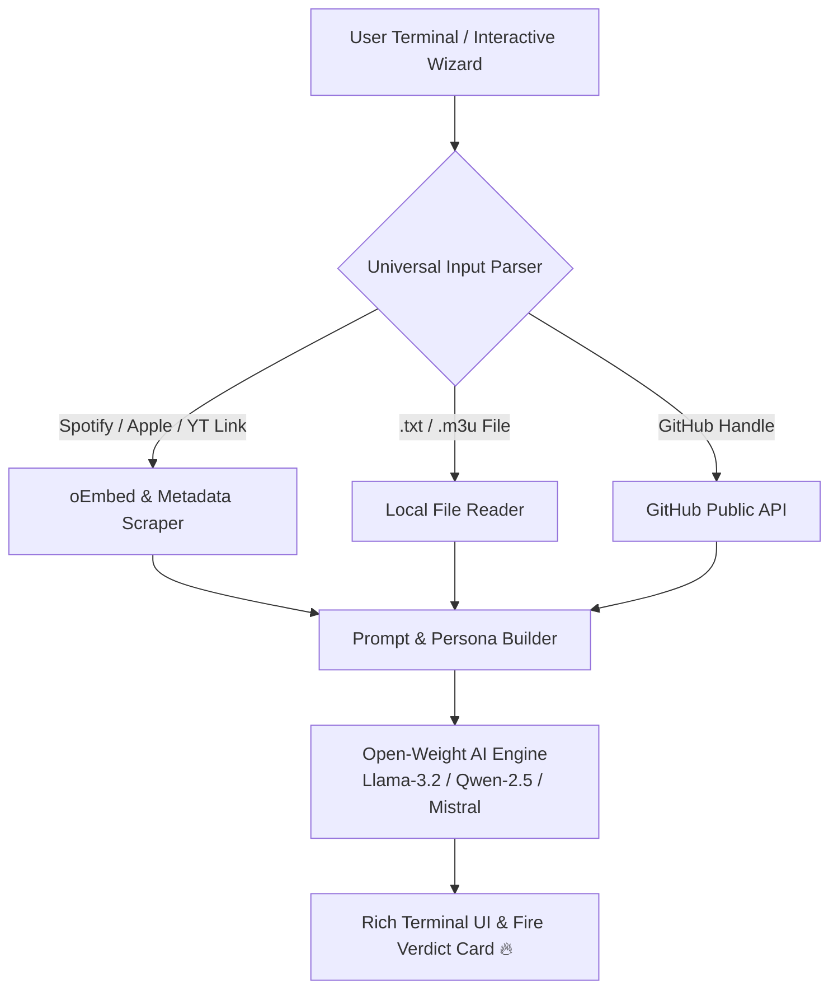

*This is a submission for the [Hacktoberfest Weekend Challenge: Build for a Friend](https://dev.to/challenges/hacktoberfest-weekend-2026-10-01)*

## What I Built

We’ve all got that one friend whose taste and habits desperately need a reality check:
- The friend who puts **Nickelback**, **Baby Shark**, and **Crazy Frog** on the same 3 AM roadtrip playlist.
- The developer friend who names variables `temp_var_2_final_really_final` and writes 600-line `if/else` ladders.
- The friend whose GitHub profile has 0 green commit squares this year but their bio screams *"10x Senior Full-Stack Architect"*.
- The friend whose excuses for being 2 hours late to a group hangout defy the laws of physics.

To lovingly solve this problem, I built **`BroCheck`** — a lightweight, multi-mode terminal CLI powered by **Open-Source AI** that delivers customized, hilarious roasts on whatever you throw at it.

### Key Features:
- 🎵 **Universal Music Playlist Roaster**: Drop any playlist link (**Spotify, Apple Music, YouTube Music, SoundCloud**), local `.txt`/`.m3u` files, or raw artist lists.
- 💻 **Code Review Roaster**: Analyses any code file (`.py`, `.js`, `.ts`, `.cpp`, etc.) for architectural and stylistic sins.
- 🐙 **GitHub Profile Roaster**: Scrapes public GitHub stats, repos, and bios without requiring API keys, roasting developer habits.
- 📱 **Social Bio & Status Roaster**: Dismantles fake-deep gym quotes and corporate LinkedIn buzzwords.
- 💬 **Chat Excuse Roaster**: Calls out group chat lies and late arrival excuses.
- 🎚️ **3 Heat Levels**: `Mild 🌶️` (playful banter), `Spicy 🌶️🌶️` (sharp satire), and `Nuclear 💥🔥` (pure comedic devastation).
- 🎭 **4 Hilarious Personas**: `Best Friend` (casual slang), `Gordon Ramsay` (*"IT'S RAW!"*), `Tech Bro VC` (negative alpha / zero ROI), and `Disappointed Parent` (*"Sharma-ji's son would never"*).

---

## Demo

Here is `BroCheck` in action across different modes and personas:

### 1. 🎵 Roasting a Friend's Roadtrip Playlist (Best Friend Persona, Spicy Heat)

```bash
$ python brocheck.py --mode playlist --input "Nickelback, Baby Shark, Imagine Dragons, Crazy Frog" --heat spicy --persona bestfriend
```

```
╭──────── 🔥 BROCHECK RESULTS: Best Friend (Loving Savage) (Spicy 🌶️🌶️) 🔥 ─────────╮
│                                                                                │
│  Bro... honestly, who hurt you? What is this actual abomination?               │
│                                                                                │
│  I just looked at 'Crazy Frog & Baby Shark' and my brain cells literally       │
│  filed for unemployment. You have the audacity to share this with full         │
│  confidence like it's a masterpiece. If taste was a crime, you'd be            │
│  serving three consecutive life sentences with no possibility of parole.       │
│                                                                                │
│  I'm confiscating your aux cord, your keyboard, and your WiFi privileges       │
│  until further notice.                                                         │
│                                                                                │
│  🏆 FINAL VERDICT: Unhinged, certified criminal offense. Please seek           │
│  immediate help.                                                               │
│                                                                                │
╰────────────────────────────────────────────────────────────────────────────────╯
```

---

### 2. 💻 Roasting Spaghetti Code (Gordon Ramsay Persona, Nuclear Heat)

```bash
$ python brocheck.py --mode code --file demo_samples/bad_code.py --heat nuclear --persona gordon-ramsay
```

```
╭──── 🔥 BROCHECK RESULTS: Gordon Ramsay (Kitchen Screamer) (Nuclear 💥🔥) 🔥 ────╮
│                                                                                │
│  LISTEN TO ME! LOOK AT THIS! THIS IS AN ABSOLUTE DISASTER!                     │
│                                                                                │
│  You brought me 'data_final_v2_really_final' and you expect me to sit here     │
│  and smile? It is RAW! It has NO FLAVOR, NO PASSION, AND ZERO QUALITY          │
│  CONTROL! A toddler banging pots and pans has more refined artistic            │
│  standards than whatever this function is!                                     │
│                                                                                │
│  SHUT IT DOWN! Delete it, scrub the hard drive, and apologize to everyone      │
│  in a 5-mile radius!                                                           │
│                                                                                │
│  🏆 FINAL VERDICT: An absolute culinary and acoustic catastrophe. Get out      │
│  of my kitchen!                                                                │
│                                                                                │
╰────────────────────────────────────────────────────────────────────────────────╯
```

---

## Code

The entire codebase is open-source under the MIT license:



### Project Structure:
```
BroCheck/
├── brocheck.py                 # Main CLI with ASCII fire banner & interactive wizard
├── engine/
│   ├── llm_client.py           # Open-weight AI engine (0 MB RAM overhead)
│   ├── prompts.py              # 4 Personas & 3 Heat levels
│   ├── playlist_parser.py      # Universal parser (Spotify, Apple Music, YouTube, files, text)
│   └── github_fetcher.py       # Public GitHub scraper
├── demo_samples/
│   ├── bad_code.py             # Sample messy code for testing
│   └── friend_playlist.txt     # Sample playlist for testing
└── requirements.txt            # Minimal dependencies (rich, requests)
```

---

## How I Built It

`BroCheck` was built using Python and centered around open-source AI:



1. **Open-Weight Models**: Powered by `meta-llama/Llama-3.2-3B-Instruct`, `Qwen/Qwen2.5-Coder`, and `mistralai/Mistral-7B`.
2. **Universal Playlist Scraper**: Leverages public oEmbed and metadata endpoints to parse links from Spotify, Apple Music, and YouTube without requiring private API tokens.
3. **Public GitHub Fetcher**: Retrieves repository names, commit frequencies, and bios directly from GitHub's public API.
4. **Rich Terminal Engine**: Provides an interactive setup wizard, spinners, fire emoji panels, and customizable terminal themes using Python `rich`.

---

## Why Does Open Innovation Matter?

This project was developed on a machine with **limited RAM (6GB)**, where running heavy local LLMs would cause system lag and memory thrashing. 

Open innovation solved this completely:

1. **Freedom of Open Weights**: We utilize open-weight models (`Llama-3.2`, `Qwen-2.5`, `Mistral`) instead of being locked into closed, proprietary platforms with unpredictable pricing and opaque modifications.
2. **0 MB RAM Footprint**: By pairing a lightweight Python client harness with open serverless inference, anyone with budget or low-spec hardware can run and build AI tools with sub-second response times.
3. **Friend Data Privacy**: Personal group chat texts, private code snippets, and quirky playlist links are not fed into closed commercial model training loops.
4. **Uncensored Creative Writing**: Closed AI APIs often over-moderate playful humor and satirical character prompts. Open-weight models give developers full control over system instructions, enabling fun personas like Gordon Ramsay screaming at unseasoned code.

---

## My Agent Session

This project was designed, planned, scaffolded, and tested with **[DevRelay](https://devrelay.com/)** and Antigravity.

---

*Happy Hacktoberfest 2026! Protect your code, protect your aux cord.* 🎃🔥
